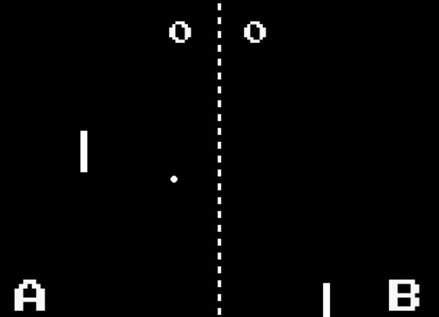

# Jogo de Ping Pong 🏓

<f2 align = "left"> **O seguinte projeto possui o objetivo de apresentar um jogo de Ping Pong em 2D. Para criar o seu projeto, siga as instruções disponíveis.**</f2>

 

<f2 align = "left"> **Passo #1**</f2>

 No seu terminal, execute o comando pip install -r requirements.txt. Este comando faz a instalação dos pacotes necessários para que o jogo rode corretamente. 

<f2 align = "left"> **Passo #2**</f2>

 Para iniciar o jogo basta executar o comando python pong.py. É levado em consideração que a estrutura de pastas é a mesma deste repositório.

<f2 align = "left"> **Passo #3**</f2>

 Teste

